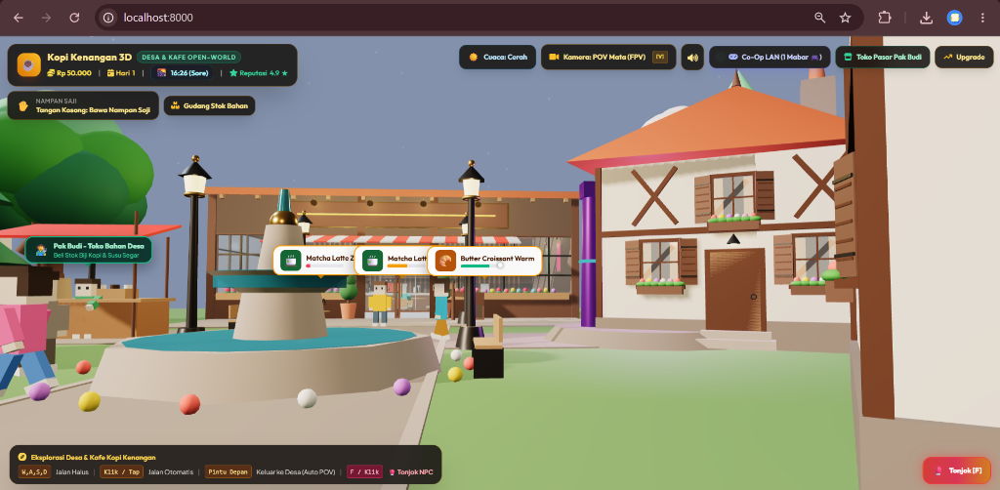
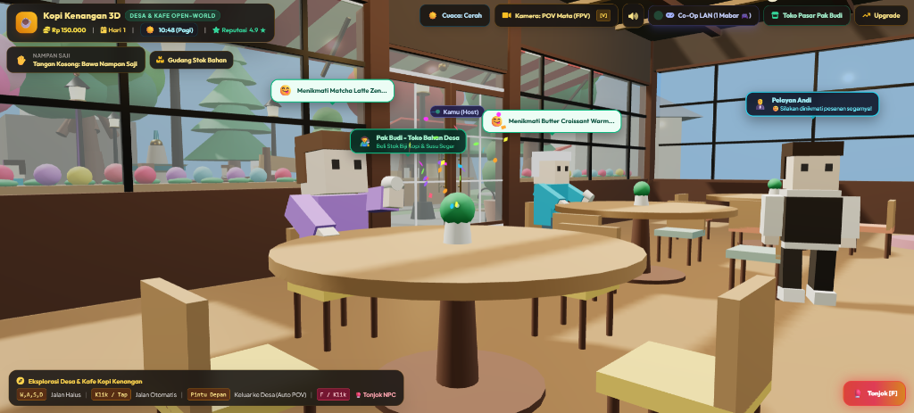
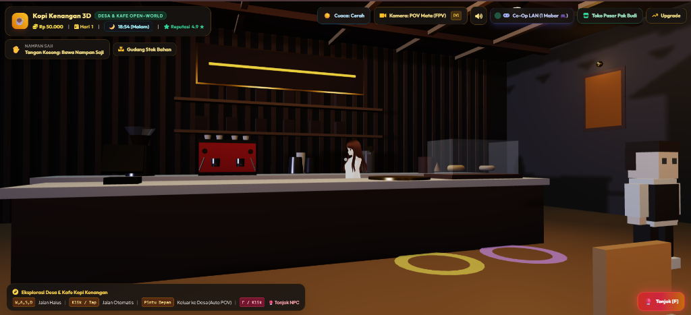

# ☕ Kafe 3D — Open-World Coffee Tycoon Simulation

 <b>Game Simulasi Bisnis Kafe 3D Berbasis Open-World & WebGL Langsung di Browser (Zero-Installation)</b> 
 Dilengkapi Agen AI Otonom (Finite State Machine), Siklus Cuaca/Waktu Dinamis, dan Arsitektur Full-Stack Flight PHP.

---

### 📸 Galeri Tampilan Game (Gameplay Showcase)

| 🌿 Eksplorasi Desa & Pasar (Outdoor) | 🍽️ Interaksi Pelanggan & Pelayan Andi (Serving) | 🌙 Suasana Interior Kafe (Night View) |
| :---: | :---: | :---: |
|  |  |  |

---

## 📖 Tentang Proyek (About The Project)

**Kafe 3D (Kopi Kenangan Tycoon)** adalah sebuah game simulasi bisnis kedai kopi interaktif generasi baru yang menggabungkan elemen manajemen ekonomi *Tycoon* dengan kebebasan eksplorasi dunia 3D (*Open-World*). 

Pemain tidak hanya mengatur menu dan strategi penjualan di dalam kafe, namun juga dapat berjalan menjelajahi desa, berbelanja bahan baku ke pasar tradisional, berinteraksi dengan NPC otonom, dan mengelola operasional kafe yang dibantu oleh staf AI cerdas (**Barista Sarah** dan **Pelayan Andi**).

Game ini dibangun secara *native* di atas **WebGL (Three.js)** dan **Flight PHP**, sehingga dapat dimainkan secara instan di browser PC maupun mobile tanpa perlu mengunduh file installer yang besar (*Zero-Installation*).

---

## ✨ Fitur-Fitur Unggulan (Key Features)

### 🌍 1. Open-World Village & Cafe Exploration
- **Dunia 3D Interaktif**: Jelajahi area kafe yang estetis, air mancur taman desa, deretan rumah bergaya pedesaan, kincir angin berputar, dan warung pasar.
- **Dual Camera Mode**: Beralih instan antara sudut pandang **Orbit Isometrik 3D** (kontrol manajemen) dan **First-Person POV (FPV)** (eksplorasi langsung).

### 🤖 2. Autonomous Staff AI (Finite State Machine)
- **Barista Sarah (VRM Model)**: AI cerdas yang secara otonom mendeteksi pesanan tamu, berjalan ke mesin espresso, meracik kopi dengan partikel uap, dan menuangkan ke nampan saji.
- **Pelayan Andi**: Secara mandiri mengambil cangkir kopi dari meja counter dan mengantarkannya tepat ke meja pelanggan yang sedang menunggu.
- **Pedagang Pak Budi**: Melayani transaksi pembelian bahan baku di pasar desa dengan dialog obrolan interaktif.
- **Customer Lifecycle**: Pelanggan datang dari jalan desa, memilih meja, memesan menu, minum dengan animasi 4-fase yang realistis, lalu membayar ke kas kafe.

### 📦 3. Manajemen Rantai Pasok & Ekonomi (Supply Chain)
- **5 Bahan Baku Utama**: *Biji Kopi, Susu Segar, Gula Aren, Bubuk Matcha, Pastry*.
- **Sistem Kulakan Pasar**: Stok bahan menipis? Berjalanlah ke Pasar Desa Pak Budi untuk membeli persediaan dengan harga grosir.
- **Toko & Upgrade Kafe**: Beli mesin grinder pro, dekorasi emas, atau sepatu lari untuk mempercepat mobilitas.

### 🌦️ 4. Dynamic Day-Night Cycle & Adaptive Weather
- **Siklus Waktu Real-Time**: Perubahan atmosfer langit dari *Subuh*, *Pagi*, *Siang*, *Sore*, hingga *Malam Hari* bertabur bintang dengan pencahayaan matahari dan bulan yang dinamis.
- **Sistem Cuaca Terpadu**: Efek cuaca *Cerah ☀️*, *Hujan Lebat 🌧️*, dan *Salju Dingin ❄️* yang mempengaruhi selera pesanan pelanggan.

### 🥊 5. Interaksi Fisik & Ragdoll Knockdown
- Dilengkapi sistem tabrakan spasial (*AABB Collision Resolution*) dan animasi aksi interaktif (Tombol Tonjok [F] / Klik pada NPC).

---

## 🎮 Panduan Kontrol (Controls Guide)

| Tombol / Input | Aksi / Fungsi |
| :--- | :--- |
| <kbd>W</kbd> <kbd>A</kbd> <kbd>S</kbd> <kbd>D</kbd> / <kbd>↑</kbd> <kbd>←</kbd> <kbd>↓</kbd> <kbd>→</kbd> | Berjalan / Navigasi Karakter Pemain |
| <kbd>Klik / Tap Area</kbd> | Jalan Otomatis (*Auto-Navigation Path*) |
| <kbd>V</kbd> atau <kbd>C</kbd> | Ganti Sudut Pandang Kamera (*Orbit 3D ⇄ POV Mata*) |
| <kbd>F</kbd> / <kbd>Klik NPC</kbd> | Interaksi Aksi / Tonjok NPC |
| <kbd>Mouse Drag</kbd> | Memutar Sudut Pandang Kamera (Orbit / FPV Look) |
| <kbd>Scroll Mouse</kbd> | Zoom In / Zoom Out Kamera |

---

## 🏛️ Arsitektur Sistem (System Architecture)

Game ini dirancang dengan prinsip pemisahan logika (*Separation of Concerns*) yang bersih antara rendering grafis dan pemrosesan backend:

`
├── 💻 Frontend (Client Layer)
│ ├── Three.js (r128 WebGL Graphics Engine)
│ ├── Tailwind CSS (Glassmorphism HUD & Responsive UI)
│ ├── Autonomous AI Finite State Machine (Barista & Waiter)
│ └── 3D Spatial Collision & Delta Bone Kinematics
│
├── ⚙️ Backend (Micro-Framework Layer)
│ ├── Flight PHP v3.0 (Fast RESTful Routing & Controller)
│ ├── App\GameEngine (Deterministic Daily Business Simulation)
│ └── Session & State Persistence
│
└── 🌐 Networking (Optional Co-Op Layer)
 └── Node.js Zero-Dependency RFC 6455 WebSocket Engine
`

---

## 🚀 Cara Menjalankan Game (Getting Started)

### Prasyarat:
- Browser modern yang mendukung WebGL (Google Chrome, Microsoft Edge, Mozilla Firefox, Safari).
- *(Opsional)* **PHP 7.4+** atau **Node.js 16+**.

### 1. Clone Repository:
`ash
git clone https://github.com/Theseadev/Kafe-3D.git
cd Kafe-3D
`

### 2. Jalankan Server Lokal:

#### 👉 Pilihan A: Menggunakan Node.js Server (Rekomendasi Cepat)
`ash
node coop_server.js
`
Buka browser di: **http://localhost:8000**

#### 👉 Pilihan B: Menggunakan PHP Built-in Server (Flight PHP)
`ash
php -S localhost:8000 index.php
`
Buka browser di: **http://localhost:8000**

---

## 📁 Struktur Direktori (Project Structure)

` ash
Kafe-3D/
├── 📁 app/
│ └── GameEngine.php # Logika kalkulasi ekonomi simulasi bisnis (Flight PHP)
├── 📁 assets/
│   ├── gameplay_preview.png        # Screenshot suasana desa & pasar luar
│   ├── cafe_interior_night.png     # Screenshot interior kafe & barista malam hari
│   ├── customer_dining_serving.png # Screenshot aktivitas pelanggan & pelayan menyajikan pesanan
│   ├── sarah_vrm.glb               # 3D VRM Model Barista Sarah
│   └── michelle.glb                # 3D Model Pelayan
├── 📁 libs/
│ ├── three.min.js # Three.js 3D Engine Library
│ ├── OrbitControls.js # Modul kontrol kamera orbit 3D
│ ├── GLTFLoader.js # 3D Model Loader
│ └── confetti.browser.min.js # Efek visual perayaan
├── .gitignore # Konfigurasi ignore file Git
├── composer.json # Konfigurasi dependensi Flight PHP
├── coop_server.js # Server HTTP & WebSocket Co-Op LAN
├── index.html # Core Game Client, Scene 3D & UI HUD
├── index.php # Entry Point Backend & Routing Flight PHP
└── README.md # Dokumentasi Lengkap Proyek
`

---

## 📄 Penelitian & Publikasi Ilmiah

Proyek ini dirancang sebagai objek penelitian ilmiah di bidang **Rekayasa Sistem Permainan 3D Berbasis Web**. 

`ibtex
@article{fahrul2026kafe3d,
 title = {Rancang Bangun Sistem Game Simulasi Bisnis 3D Open-World Berbasis WebGL dan Micro-Framework Flight PHP Menggunakan Arsitektur Finite State Machine},
 author = {Fahrul Bahri},
 year = {2026},
 journal = {Jurnal Rekayasa Sistem dan Teknologi Informasi}
}
`

---

## 👤 Pengembang (Author)

* **Fahrul Bahri** ([@Theseadev](https://github.com/Theseadev))
 * Email: Fahrulbahri0520@gmail.com
 * GitHub: [https://github.com/Theseadev](https://github.com/Theseadev)

---

 Dibuat dengan ❤️ menggunakan Three.js, WebGL, dan Flight PHP.

